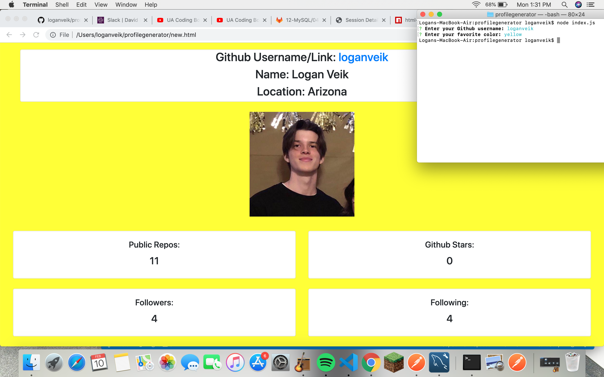

# profilegenerator

The assignment has 2 parts, the username input which dispalys the users github info to the page, and the color input which the user can type whatever color and the background of the displayed image is whatever color the user chose. I did the basic assignment which was to capture the users github username and favorite color and display that info to the page.
